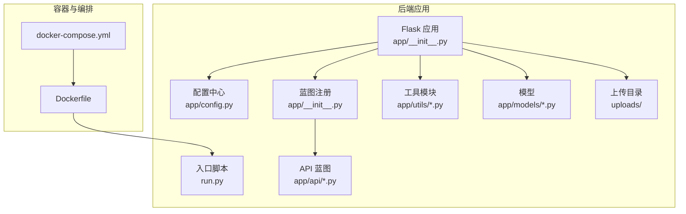
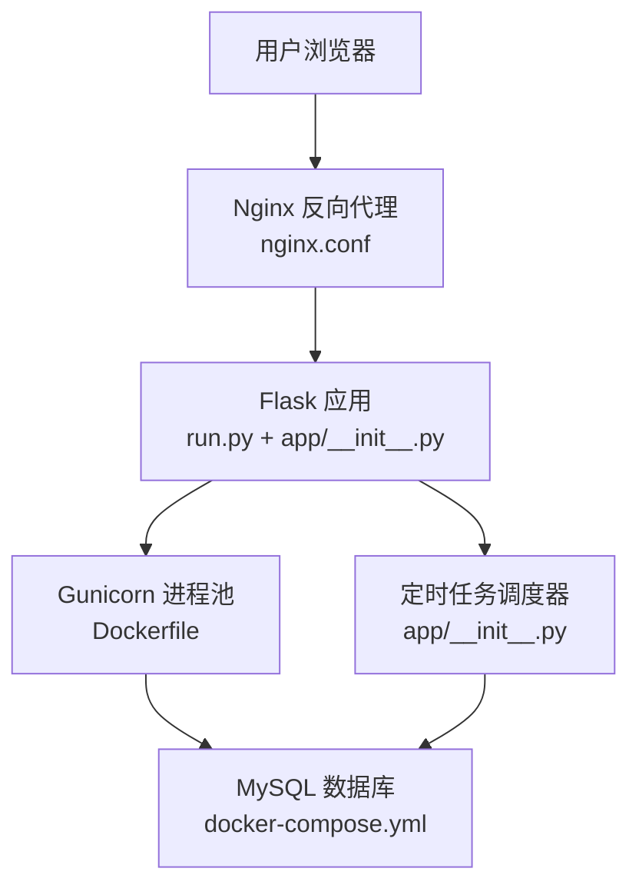
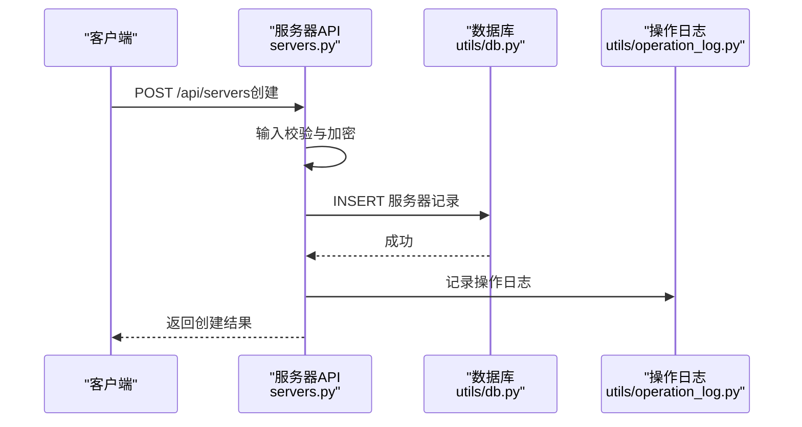
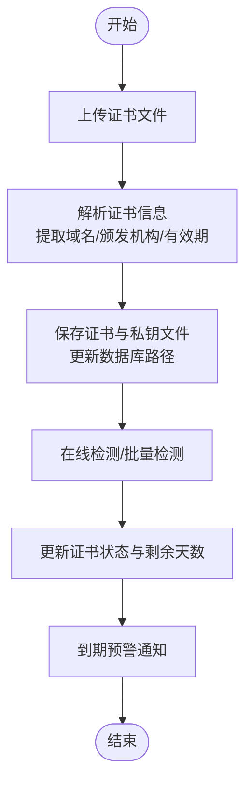
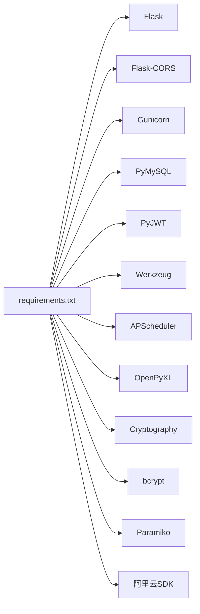

# 项目概述

<cite>
**本文引用的文件**
- [backend/app/__init__.py](file://backend/app/__init__.py)
- [backend/app/config.py](file://backend/app/config.py)
- [backend/run.py](file://backend/run.py)
- [backend/Dockerfile](file://backend/Dockerfile)
- [docker-compose.yml](file://docker-compose.yml)
- [backend/app/api/servers.py](file://backend/app/api/servers.py)
- [backend/app/api/apps.py](file://backend/app/api/apps.py)
- [backend/app/api/certs.py](file://backend/app/api/certs.py)
- [backend/app/api/domains.py](file://backend/app/api/domains.py)
- [backend/app/api/projects.py](file://backend/app/api/projects.py)
- [backend/app/utils/db.py](file://backend/app/utils/db.py)
- [backend/app/utils/decorators.py](file://backend/app/utils/decorators.py)
- [backend/app/utils/password_utils.py](file://backend/app/utils/password_utils.py)
- [backend/init_db.py](file://backend/init_db.py)
- [backend/requirements.txt](file://backend/requirements.txt)
</cite>

## 目录
1. [引言](#引言)
2. [项目结构](#项目结构)
3. [核心组件](#核心组件)
4. [架构总览](#架构总览)
5. [详细组件分析](#详细组件分析)
6. [依赖分析](#依赖分析)
7. [性能考虑](#性能考虑)
8. [故障排查指南](#故障排查指南)
9. [结论](#结论)
10. [附录](#附录)

## 引言
OPS运维管理平台是一个面向企业级的统一运维管理与可视化平台，旨在简化多环境服务器、应用系统、域名与证书等资产的全生命周期管理。平台采用Flask微服务架构，结合Docker容器化部署，提供高可用、可扩展、易维护的运维能力。

平台核心目标：
- 统一资产管理：服务器、应用系统、域名、证书、项目等资源集中管理与关联。
- 多环境支持：支持测试、生产、智慧环保、水电集团等多环境标签化管理。
- 安全与合规：内置JWT鉴权、敏感数据对称加密、操作审计日志与最小权限控制。
- 自动化与可观测性：定时任务调度、证书/域名到期预警、Grafana集成等。

适用场景：
- 中大型企业IT运维团队的统一资产管理与运营。
- 需要跨环境、跨项目的资源编排与可视化展示。
- 对证书与域名到期风险进行主动监控与预警的企业。

## 项目结构
后端采用Flask应用结构，按功能域划分蓝图（Blueprint），核心目录如下：
- app：应用入口与配置、蓝图注册、工具模块
- app/api：各业务域API（服务器、应用、证书、域名、项目、任务等）
- app/utils：通用工具（数据库连接、鉴权、密码加解密、调度、校验等）
- app/models：模型定义（当前示例包含用户模型）
- uploads：上传目录（脚本与证书文件）
- Dockerfile与docker-compose：容器化与编排

图表来源
- [backend/app/__init__.py:28-149](file://backend/app/__init__.py#L28-L149)
- [backend/app/config.py:10-58](file://backend/app/config.py#L10-L58)
- [backend/run.py:1-8](file://backend/run.py#L1-L8)
- [backend/Dockerfile:1-36](file://backend/Dockerfile#L1-L36)
- [docker-compose.yml:1-103](file://docker-compose.yml#L1-L103)

章节来源
- [backend/app/__init__.py:28-149](file://backend/app/__init__.py#L28-L149)
- [backend/app/config.py:10-58](file://backend/app/config.py#L10-L58)
- [backend/run.py:1-8](file://backend/run.py#L1-L8)
- [backend/Dockerfile:1-36](file://backend/Dockerfile#L1-L36)
- [docker-compose.yml:1-103](file://docker-compose.yml#L1-L103)

## 核心组件
- 应用入口与蓝图注册：创建Flask应用、配置CORS、注册全部API蓝图、数据库连接钩子与Schema初始化、定时任务调度器初始化。
- 配置中心：集中管理JWT密钥、数据库连接、CORS策略、告警阈值、Grafana集成等。
- 数据库工具：封装连接获取、关闭与连接日志，确保启动阶段连接校验。
- 权限与鉴权：JWT认证与角色权限装饰器，结合用户模型实现最小权限控制。
- 密码与敏感数据：基于Fernet的对称加密与bcrypt哈希，保障服务器密码、阿里云密钥等安全存储与传输。
- API域：服务器、应用、证书、域名、项目、任务、导出、监控、仪表盘等模块化接口。

章节来源
- [backend/app/__init__.py:28-149](file://backend/app/__init__.py#L28-L149)
- [backend/app/config.py:10-58](file://backend/app/config.py#L10-L58)
- [backend/app/utils/db.py:43-80](file://backend/app/utils/db.py#L43-L80)
- [backend/app/utils/decorators.py:26-163](file://backend/app/utils/decorators.py#L26-L163)
- [backend/app/utils/password_utils.py:93-130](file://backend/app/utils/password_utils.py#L93-L130)

## 架构总览
平台采用“前端静态页面 + Nginx反向代理 + 后端Flask服务 + MySQL数据库”的经典三层架构。容器化通过Docker Compose编排，后端使用Gunicorn承载，具备健康检查与自动重启能力。

图表来源
- [backend/run.py:1-8](file://backend/run.py#L1-L8)
- [backend/app/__init__.py:88-113](file://backend/app/__init__.py#L88-L113)
- [backend/Dockerfile:34-36](file://backend/Dockerfile#L34-L36)
- [docker-compose.yml:30-80](file://docker-compose.yml#L30-L80)

章节来源
- [backend/run.py:1-8](file://backend/run.py#L1-L8)
- [backend/app/__init__.py:88-113](file://backend/app/__init__.py#L88-L113)
- [backend/Dockerfile:34-36](file://backend/Dockerfile#L34-L36)
- [docker-compose.yml:30-80](file://docker-compose.yml#L30-L80)

## 详细组件分析

### 服务器管理（多环境、多平台、项目关联）
- 功能要点：分页查询、条件过滤（环境类型、平台、项目、模糊搜索）、详情联动服务与项目、密码字段加密存储与解密返回、批量项目关联。
- 关键流程：创建/更新/删除服务器，涉及输入校验、敏感字段加密、项目关联更新、操作日志记录。
- 安全与合规：密码字段在入库前加密，在返回前解密，避免明文泄露；支持项目维度隔离。

图表来源
- [backend/app/api/servers.py:189-354](file://backend/app/api/servers.py#L189-L354)
- [backend/app/utils/db.py:43-80](file://backend/app/utils/db.py#L43-L80)

章节来源
- [backend/app/api/servers.py:14-578](file://backend/app/api/servers.py#L14-L578)

### 应用系统管理（账号台账与项目关联）
- 功能要点：应用列表、详情（含密码解密）、创建/更新/删除、URL与长度校验、项目维度查询。
- 安全要点：密码入库加密，返回时解密；支持项目筛选与分页。

章节来源
- [backend/app/api/apps.py:14-343](file://backend/app/api/apps.py#L14-L343)

### 证书管理（上传解析、在线检测、到期预警）
- 功能要点：手动录入、上传证书文件解析、在线SSL检测、批量检测、到期预警通知、证书文件存储与路径管理。
- 安全要点：证书与私钥文件落盘，路径安全校验，防止路径穿越；证书信息解析与有效期计算。
- 自动化：定时任务配置项，支持按Cron周期执行检测与通知。

图表来源
- [backend/app/api/certs.py:323-466](file://backend/app/api/certs.py#L323-L466)
- [backend/app/api/certs.py:585-707](file://backend/app/api/certs.py#L585-L707)
- [backend/app/api/certs.py:799-800](file://backend/app/api/certs.py#L799-L800)

章节来源
- [backend/app/api/certs.py:154-800](file://backend/app/api/certs.py#L154-L800)

### 域名管理（阿里云同步、到期预警）
- 功能要点：手动录入、阿里云域名同步（兼容PascalCase/snake_case）、到期预警通知、项目维度管理。
- 集成能力：阿里云域名SDK，支持分页查询与状态映射。

章节来源
- [backend/app/api/domains.py:34-664](file://backend/app/api/domains.py#L34-L664)

### 项目管理（资源聚合视图）
- 功能要点：项目列表与统计、详情聚合（服务器、服务、域名、证书、账号）、项目-服务器关联与解除、项目维度查询。
- 关联视图：通过子查询聚合各资源数量，便于快速掌握项目资产状况。

章节来源
- [backend/app/api/projects.py:13-521](file://backend/app/api/projects.py#L13-L521)

### 鉴权与权限控制
- JWT认证：校验令牌有效性、用户存在与启用状态、密码变更后作废旧令牌。
- 角色权限：基于装饰器的角色白名单校验，确保最小权限原则。
- 用户模型：用户信息来源于数据库，支持角色与状态管理。

章节来源
- [backend/app/utils/decorators.py:26-163](file://backend/app/utils/decorators.py#L26-L163)

### 数据库与初始化
- 连接管理：Flask g上下文缓存连接，启动阶段连接日志与异常堆栈输出。
- 初始化脚本：自动创建数据库与表结构，插入默认字典数据与管理员账户，兼容历史表字段升级。

章节来源
- [backend/app/utils/db.py:43-80](file://backend/app/utils/db.py#L43-L80)
- [backend/init_db.py:22-395](file://backend/init_db.py#L22-L395)

### 容器化与部署
- Dockerfile：Python 3.11 Slim镜像、系统依赖安装、Gunicorn承载、单worker多线程、健康检查。
- docker-compose：MySQL、后端、Nginx三服务编排，环境变量集中配置，卷挂载上传目录，服务间依赖与健康检查。

章节来源
- [backend/Dockerfile:1-36](file://backend/Dockerfile#L1-L36)
- [docker-compose.yml:1-103](file://docker-compose.yml#L1-L103)

## 依赖分析
- 后端依赖：Flask、Flask-CORS、Gunicorn、PyMySQL、PyJWT、Werkzeug、APScheduler、OpenPyXL、Cryptography、bcrypt、Paramiko、阿里云相关SDK。
- 依赖关系：应用入口依赖配置中心与工具模块；API蓝图依赖数据库工具与装饰器；证书/域名模块依赖SSL检查与通知工具；项目模块依赖关联表与聚合查询。

图表来源
- [backend/requirements.txt:1-17](file://backend/requirements.txt#L1-L17)

章节来源
- [backend/requirements.txt:1-17](file://backend/requirements.txt#L1-L17)

## 性能考虑
- 连接池与上下文：数据库连接通过Flask应用上下文缓存，减少连接开销；启动阶段预检连接，失败快速暴露。
- 线程模型：Gunicorn单worker多线程，避免APScheduler多进程重复注册；线程安全与超时配置需结合业务调优。
- 分页与索引：API普遍支持分页与条件过滤，建议在高频查询字段建立索引（如环境类型、IP、域名、项目ID）。
- 证书与域名检测：批量检测与到期预警建议按Cron周期执行，避免频繁在线探测带来的外部依赖压力。
- 缓存与CDN：前端静态资源由Nginx提供，建议结合CDN加速与缓存策略提升用户体验。

## 故障排查指南
- 数据库连接失败：检查环境变量DB_HOST/DB_PORT/DB_USER/DB_PASSWORD/DB_NAME，确认MySQL服务可达与网络互通；查看启动日志中的连接参数脱敏输出。
- JWT认证失败：确认Authorization头格式为Bearer Token，检查令牌是否过期或用户被禁用；若密码变更导致令牌作废，需重新登录。
- 证书/域名同步异常：阿里云SDK未安装会导致同步失败；检查AccessKey配置与网络连通性；关注API响应与日志输出。
- 上传文件异常：证书/私钥文件大小限制与格式限制，确保.pem/.crt/.key格式正确；检查上传目录权限与磁盘空间。
- 定时任务未执行：确认Cron表达式与调度器初始化；检查日志中任务执行状态与异常堆栈。

章节来源
- [backend/app/__init__.py:88-113](file://backend/app/__init__.py#L88-L113)
- [backend/app/utils/decorators.py:26-163](file://backend/app/utils/decorators.py#L26-L163)
- [backend/app/api/domains.py:335-594](file://backend/app/api/domains.py#L335-L594)
- [backend/app/api/certs.py:323-466](file://backend/app/api/certs.py#L323-L466)

## 结论
OPS运维管理平台以Flask为核心，结合Docker容器化与微服务架构，构建了覆盖多环境服务器、应用系统、域名与证书的统一管理平台。通过严格的权限控制、敏感数据加密与完善的日志审计，平台在保障安全性的同时，提供了良好的可扩展性与可观测性。建议在生产环境中完善密钥管理、网络隔离与备份策略，并根据业务规模调整数据库索引与Gunicorn线程配置，持续优化性能与稳定性。

## 附录
- 技术栈概览：Flask、Flask-CORS、Gunicorn、PyMySQL、PyJWT、Werkzeug、APScheduler、OpenPyXL、Cryptography、bcrypt、Paramiko、阿里云SDK。
- 系统特性亮点：多环境标签化、项目维度聚合、证书/域名自动化检测与预警、敏感数据对称加密、操作审计日志、定时任务调度。
- 差异化优势：一体化资产管理、项目关联视图、阿里云生态集成、容器化一键部署、中文友好与日志可观测性。